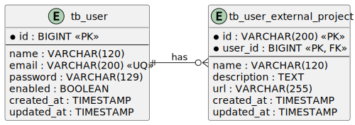

# PartnerHub

Backend API built with Spring Boot 3.5 and Java 21 for managing users and their external projects.

---

## 🚀 Tech Stack

- Java 21 + Spring Boot 3.5
- Spring Data JPA + PostgreSQL
- RESTful API with OpenAPI 3 (Swagger UI)
- MapStruct for DTO mapping
- JUnit 5 for unit/integration testing
- Docker + Docker Compose + Testcontainers
- Micrometer + Prometheus + Grafana  
- Logback + JSON structured logs

---

## 📋 Requirements

### ✅ Minimal requirements

- [x] Application should have at least basic auth
- [x] Create a new user
- [x] Retrieve user information
- [x] Delete a user
- [x] Add external project to a user
- [x] Retrieve external projects from a user
- [x] Write unit tests to ensure the correctness of the controller and service logic
- [x] Containerize project using docker

### ✅ Optional extras

- [x] Update user information
- [x] Configure logs
- [x] Configure metrics
- [x] Configure docker compose with database and service and all necessary ports to be tested
- [x] <span style="color:#2ea44f">Grafana dashboard</span>
- [x] <span style="color:#2ea44f">Validations</span>

---

## 📦 Features

- [x] Basic Authentication (HTTP Basic)
- [x] Create a new user (`POST /api/users`)
- [x] Retrieve user information (`GET /api/users/{id}`)
- [x] Delete a user (`DELETE /api/users/{id}`)
- [x] Update a user (`PUT /api/users/{id}`)
- [x] Add external project to user (`POST /api/users/{id}/projects`)  
- [x] Retrieve external projects from a user (`GET /api/users/{id}/projects`)   
- [x] Unit & integration tests
- [x] Dockerized application
- [x] JSON-structured logging with Logback
- [x] Prometheus metrics via Spring Boot Actuator
- [x] Grafana dashboard with preconfigured panels for:
  - HTTP requests per endpoint (real-time count)
  - Average response time per URI (latency)
  - JVM heap memory usage (MB)
  - Total live threads in the application
  - Errors by endpoint (4xx and 5xx)
  - Success rate (% of requests with status 2xx)
- [x] Docker Compose with PostgreSQL, Prometheus and Grafana  

---

## 📚 API Documentation

- 📖 Swagger UI: http://localhost:8081  
- 📄 OpenAPI YAML: http://localhost:8081/openapi.yaml  

---

## 🐳 Running locally

### Requirements

- Java 21
- Docker & Docker Compose  

### Start the project

```bash
docker-compose up -d --build
```

### Run tests

```bash
./gradlew test
```

### Generate coverage report

```bash
./gradlew jacocoTestReport
open build/reports/jacoco/test/html/index.html
```

### 📡 Access the services

- 📦 API: http://localhost:8080
- 📊 Grafana dashboard: http://localhost:3000 (default: user admin / password admin)
- 📈 Prometheus: http://localhost:9090

### Stop everything

```bash
docker-compose down # use -v to remove volumes 
```

---

## 🔐 Authentication

All endpoints are protected with Basic Auth.

**Default credentials:**

```
username: admin
password: admin
```

You can configure your own via `application.properties`.

---

## 📊 Observability

The application is fully observable:

- `/actuator/health` – health checks
- `/actuator/metrics` – Prometheus metrics
- Logs: structured JSON via LogstashEncoder (works with Loki)  

Grafana dashboard auto-import available on first run.

---

## 🧾 ER Model

<p align="center">
  
</p>
<p align="center">
  <a href="docs/erm.plantuml">PlantUML source code</a>
</p>


```sql
CREATE TABLE tb_user (
    id BIGSERIAL PRIMARY KEY,
    name VARCHAR(120) NOT NULL,
    email VARCHAR(200) NOT NULL UNIQUE,
    password VARCHAR(129) NOT NULL,
    enabled BOOLEAN DEFAULT TRUE,
    created_at TIMESTAMP NOT NULL DEFAULT NOW(),
    updated_at TIMESTAMP NOT NULL DEFAULT NOW()
);

CREATE TABLE tb_user_external_project (
    id VARCHAR(200) NOT NULL,
    user_id BIGINT NOT NULL,
    name VARCHAR(120) NOT NULL,
    description TEXT,
    url VARCHAR(255),
    created_at TIMESTAMP NOT NULL DEFAULT NOW(),
    updated_at TIMESTAMP NOT NULL DEFAULT NOW(),
    PRIMARY KEY (id, user_id),
    CONSTRAINT fk_user
        FOREIGN KEY (user_id)
        REFERENCES tb_user(id)
        ON DELETE CASCADE
);
```

---

## 🛠 Load testing with k6

```bash
cd load-testing
docker-compose -f docker-compose.k6.yml up
```

---

## 📄 License

[MIT](LICENSE "License") – Feel free to use, fork, or improve.
